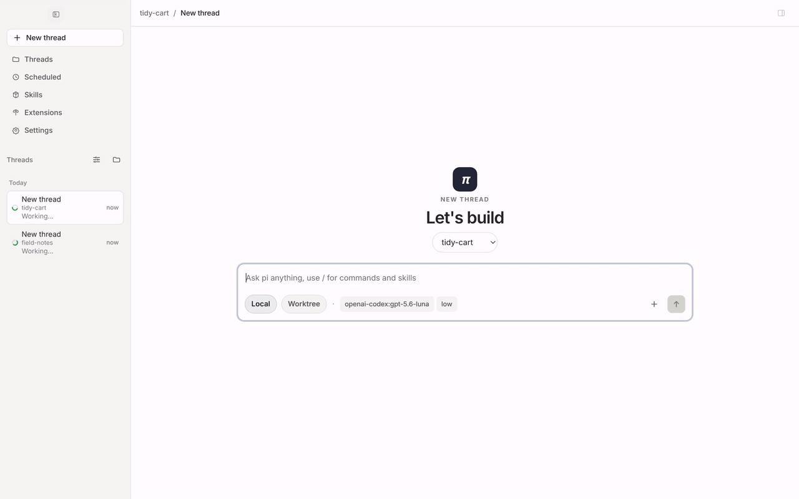
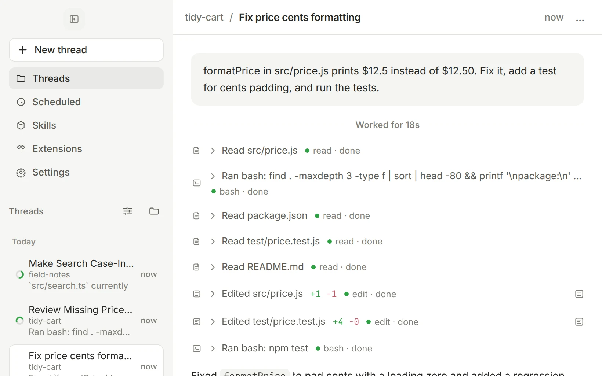
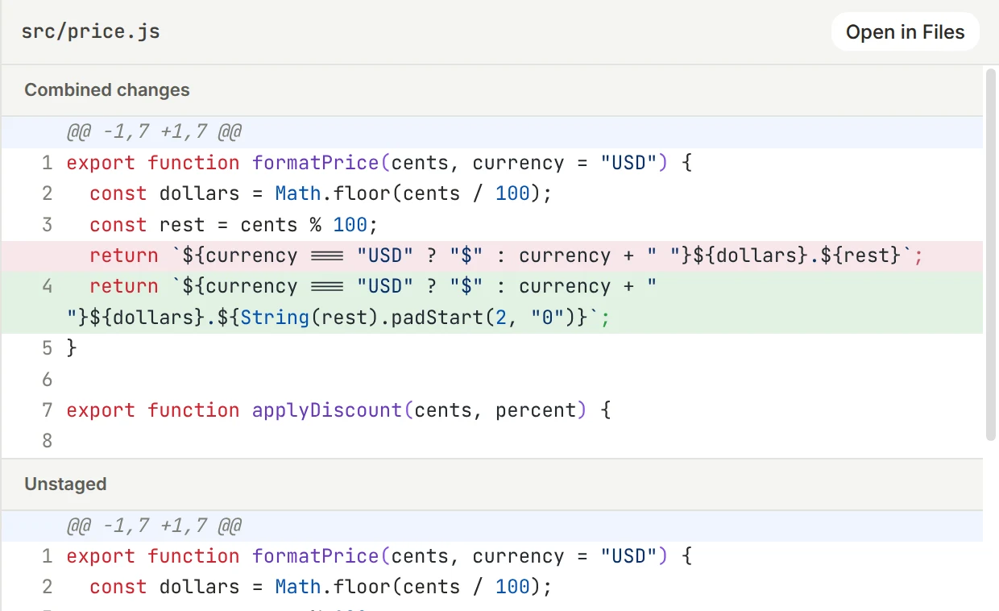
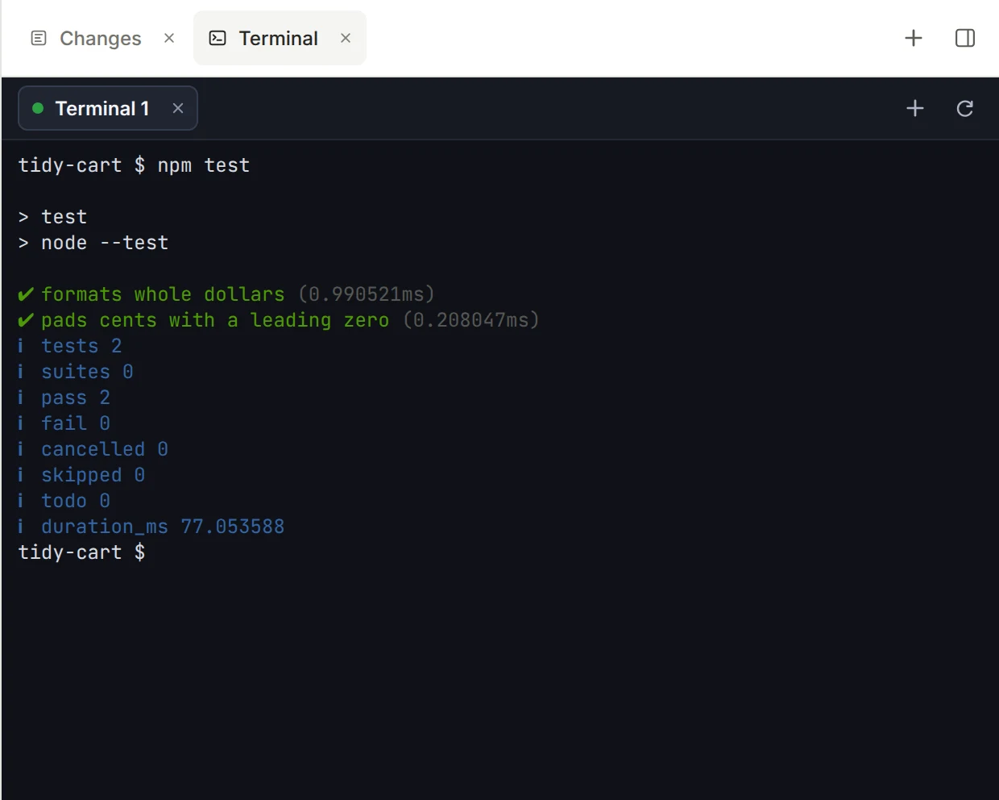
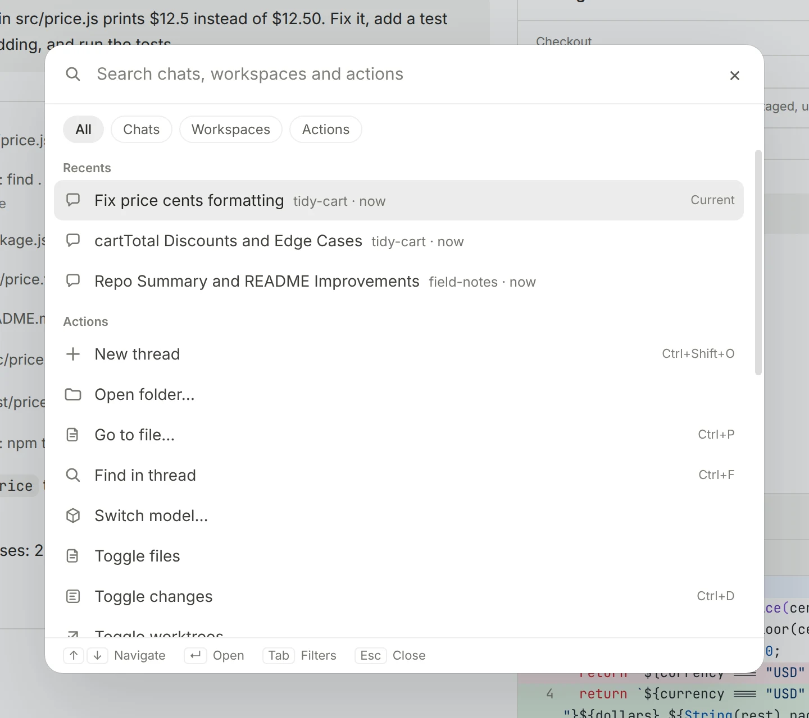

# pi-gui

The desktop app for the [pi](https://github.com/earendil-works/pi) coding agent.

[](./LICENSE)
[](https://github.com/minghinmatthewlam/pi-gui/releases)
[](#install)

Run agents in parallel threads, each in its own git worktree if you want one. Review every
change, run the tests in a real terminal, and ship without leaving the window. pi-gui is a
desktop shell around [`@earendil-works/pi-coding-agent`](https://www.npmjs.com/package/@earendil-works/pi-coding-agent),
not a separate agent: sessions, models, auth and tools all run through pi itself, so anything
you set up with the pi CLI carries over.

[](./apps/website/public/media/hero.mp4)

<sub>A real run: the agent fixes a bug, adds a test and runs it, then the change opens for review. ([Watch in full quality](./apps/website/public/media/hero.mp4))</sub>

## Features

### Run agents side by side

Every task gets its own thread. Start it in your checkout or in a fresh git worktree, then
start the next one while it works. The sidebar shows what is running, what finished and what
needs you. Pin threads, group them by time or workspace, and archive the ones you are done with.



### Review every change before it lands

The Review tab shows exactly what the agent touched. Compare uncommitted work, a branch
against its base, or a single turn, and stage or unstage it file by file.

<picture>
  <source media="(prefers-color-scheme: dark)" srcset="./apps/website/public/media/review-dark.webp">
  
</picture>

### Terminal and files in the same window

The workbench beside the conversation holds a real terminal, a file explorer and editor,
the review tab, your worktrees, and tabs from desktop extensions. Each task keeps its own layout.

<picture>
  <source media="(prefers-color-scheme: dark)" srcset="./apps/website/public/media/terminal-dark.webp">
  
</picture>

### Everything is a keystroke away

<picture>
  <source media="(prefers-color-scheme: dark)" srcset="./apps/website/public/media/palette-dark.webp">
  
</picture>

| Shortcut (macOS; use Ctrl on Linux and Windows)    | Does                                  |
| -------------------------------------------------- | ------------------------------------- |
| <kbd>⌘</kbd> <kbd>K</kbd>                          | Search chats, workspaces and actions  |
| <kbd>⌘</kbd> <kbd>P</kbd>                          | Open any file in the current checkout |
| <kbd>Ctrl</kbd> <kbd>Tab</kbd>                     | Switch between recent threads         |
| <kbd>⌘</kbd> <kbd>1</kbd> to <kbd>9</kbd>          | Jump to a thread in the sidebar       |
| <kbd>⌘</kbd> <kbd>J</kbd>                          | Toggle the terminal                   |
| <kbd>⌘</kbd> <kbd>R</kbd>                          | Toggle the Review tab                 |
| <kbd>⌘</kbd> <kbd>⌥</kbd> <kbd>B</kbd>             | Show or hide the workbench            |
| <kbd>Enter</kbd> while a run is going              | Queue a follow-up                     |
| <kbd>⌘</kbd> <kbd>Enter</kbd> while a run is going | Steer the current run                 |

### And the rest

- **Scheduled tasks.** Have pi rerun a prompt on a schedule, such as a weekly dependency
  check, while the app is open.
- **Skills and extensions.** Turn pi skills and extensions on and off, try them from the
  composer, and give desktop extensions their own workbench tabs.
- **Any provider.** Sign in with OAuth, paste an API key, or point at a custom endpoint.
  Pick the model and thinking level per thread.
- **Fork and rewind.** Fork a thread from any message into the same checkout or a new
  worktree, and move around the session tree with `/tree`.
- **Composer.** `@`-mention files, and paste or drop images into the prompt.
- **Threads that run threads.** An agent can start, read and message other threads, which
  show up in the sidebar like any other.
- **Notifications.** Get told when a background thread finishes, fails or needs you.
- **Themes.** Light and dark, plus presets like Catppuccin, Tokyo Night, Nord, Dracula,
  Gruvbox and GitHub.

## Install

pi-gui runs on macOS (Apple Silicon), Linux (x64) and Windows (x64).

Download the latest `.dmg` (macOS), `.AppImage` or `.deb` (Linux), or `.exe` (Windows) from the
[Releases page](https://github.com/minghinmatthewlam/pi-gui/releases).

- **macOS:** drag `pi-gui.app` into Applications. Releases are signed and notarized.
- **Linux:** make the AppImage executable and run it, or install the `.deb`.
- **Windows:** run the setup `.exe`, or use the portable `.exe`. Builds are not code-signed
  yet, so SmartScreen may ask you to confirm.

On macOS you can also use Homebrew:

```bash
brew tap minghinmatthewlam/tap
brew install --cask pi-gui
```

Update with `brew upgrade --cask pi-gui`. A Homebrew upgrade may ask you to
re-confirm macOS permissions or Dock placement. Other installs tell you when a new release is
out and update from the Releases page.

Building from source is for contributors; see [Development](#development).

## Quickstart

1. Install pi-gui and open it.
2. Open **Settings → Providers** and connect a model provider (OAuth or API key).
3. Add a workspace: a local project folder.
4. Click **New thread**, choose **Local** or **Worktree**, and send your first prompt.

pi-gui reads and writes pi's own session files and settings, so threads, credentials and
skills are shared with the pi CLI.

## Architecture

pi-gui is an Electron app with a tight main, preload and renderer boundary, on top of the pi
runtime:

- **Renderer** (`apps/desktop/src`): the React UI, including the timeline, composer,
  workbench and settings. It talks to the main process only through a typed IPC surface.
- **Preload** (`apps/desktop/electron/preload.ts`): the narrow bridge that exposes that IPC
  surface. The renderer gets no broad Node access.
- **Main** (`apps/desktop/electron`): windows, session supervision, worktrees, terminal PTYs,
  scheduled tasks, notifications and persistence.
- **`packages/pi-sdk-driver`**: a thin adapter over `@earendil-works/pi-coding-agent`. It stays
  close to upstream pi and does not fork or reimplement runtime behavior.
- **Session files are the source of truth.** pi stores each session as a JSONL transcript on
  disk, and pi-gui reads those files rather than keeping its own copy.

See [docs/architecture.md](docs/architecture.md) for ownership and boundaries.

## Development

Requires Node 22.19 or newer (CI runs Node 22) and [pnpm](https://pnpm.io) through `corepack`.
`pnpm-lock.yaml` is the authoritative lockfile.

```bash
corepack enable
pnpm install
```

Common commands, from the repo root:

```bash
pnpm dev            # run the desktop app with hot reload
pnpm check          # CI baseline: format, lint, renderer boundaries, types, guard and driver tests
pnpm build          # build the desktop app and the website
pnpm typecheck      # type-check all workspaces
pnpm lint           # correctness rules plus typed promise and unsafe-any checks
pnpm format         # apply the shared formatter
pnpm test           # each workspace's tests (desktop runs the core E2E lane)
pnpm marketing:media  # re-record the README and website media from a real agent run
```

`pnpm check` is the shared local and CI baseline. It does not launch Electron or replace the
desktop, website-build and package CI jobs; see [docs/ci-baseline.md](docs/ci-baseline.md).

Desktop end-to-end tests drive the real Electron app with Playwright, in lanes. `pnpm test`
runs the `core` lane; to run everything:

```bash
pnpm --filter @pi-gui/desktop run test:e2e:all   # core + live + native
```

See [`apps/desktop/README.md`](./apps/desktop/README.md) for the lanes, packaging on each
platform, and how the product media is recorded.

## Repository layout

- `apps/desktop`: the Electron app (renderer, main and preload).
- `apps/website`: [pi-gui.com](https://www.pi-gui.com).
- `packages/pi-sdk-driver`: the adapter over `@earendil-works/pi-coding-agent`.
- `packages/session-driver`: shared session driver types.
- `packages/catalogs`: workspace and session catalog state.
- `packages/extension-ui`: helpers for building desktop extension views.
- `examples/desktop-extensions`: example extensions with their own workbench tabs.
- `video`: the Remotion showcase video.
- `docs`: architecture, CI and design notes.
- `.agents/skills`: checked-in agent skills, including desktop verification.

## Contributing

Contributions are welcome. See [CONTRIBUTING.md](./CONTRIBUTING.md) for setup, verification
expectations and the desktop test lanes. Desktop changes should be verified on the real
Electron app, not only by unit tests.

## Computer use

Native computer use is not built into pi-gui. Desktop and browser control is available
separately through the standalone
[`computer-use-mcp`](https://github.com/minghinmatthewlam/computer-use-mcp) server, which any
MCP-capable agent can use.

## Acknowledgements

Built on [`@earendil-works/pi-coding-agent`](https://www.npmjs.com/package/@earendil-works/pi-coding-agent)
and the [pi](https://github.com/earendil-works/pi) runtime and ecosystem.

## License

[MIT](./LICENSE) © Matthew Lam
