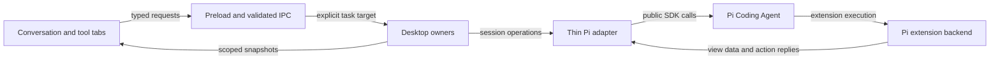

# Workspace redesign: implementation design

Status: proposed workspace architecture, September 22, 2026. The user authorized the Pi upgrade and Chord evaluation; frontend redesign implementation remains separate. Grounded in pi-gui `f06a5501dbcf1f39e105f0375ae7646bd9841c8f`, the approved tabbed workspace prototype, and installed upstream release `v0.87.0`. The earlier blocks-first/custom service-and-state protocol recommendation is superseded.

## Recommendation

First upgrade and verify the integration with the latest released Pi Coding Agent, currently 0.87.0. Then reimplement the frontend workspace composition while retaining established desktop owners. Make the conversation the main surface; Files, Changes, Worktrees, Terminal, and optional extension views use one companion workspace with task-local tabs. Keep the runtime upgrade a focused change so compatibility failures can be separated from visual changes.

The composer keeps both model and reasoning level visible. The side-workspace toggle is icon-only, with an accessible name, tooltip, pressed state, and existing keyboard shortcut. Appearance and density stay in Settings. There is no local/cloud picker when only local operation exists.

Use Chord for extension services, state and lifecycle; the installed 0.87.0 APIs passed Node/browser feasibility probes. Pi-gui supplies the desktop view host and a small registration adapter to existing Pi extensions. A fixed blocks schema is no longer the chosen public interface. The [custom frontend design](chord-desktop-extension-design.md) defines the author contract, missing host responsibilities and remaining Electron proof. Its Pi EventBus bootstrap is discovery only, not a second service/state protocol.

## Current behavior and the change

| Area         | Verified today                                                                                                                    | Proposed change                                                                                                                   |
| ------------ | --------------------------------------------------------------------------------------------------------------------------------- | --------------------------------------------------------------------------------------------------------------------------------- |
| Shell        | `App.tsx` separately owns Files/Changes mode, document tabs, and terminal visibility. Selection changes clear some of this state. | One workbench controller owns opening, focusing, closing, hiding, and restoring tools.                                            |
| Conversation | Draft synchronization, timeline viewport, explicit session targeting, queued messages, model/thinking controls already exist.     | Recompose and restyle these features; preserve their behavior and ownership.                                                      |
| Changes      | Current working-tree status, grouped across checkout contexts. The file-diff helper prefers unstaged over staged content.         | Explicit checkout and comparison, correct partial-staging presentation, then branch and captured-turn review.                     |
| Terminal     | Main owns PTYs, scoped by window, canonical checkout, and task. Renderer unmount does not terminate them.                         | Render the same service in a tool tab; view lifetime remains separate from shell lifetime.                                        |
| Extensions   | Pi UI calls become dialogs, notifications, status, and text widgets. The app has no desktop view registration API.                | Preserve existing compatibility; prove custom desktop views using current upstream APIs before defining the missing GUI contract. |
| Persistence  | Pi owns session data; catalogs own workspace/session records; desktop owns validated UI state.                                    | Add layout preferences and review metadata to desktop-owned storage; do not copy Pi history or extension findings into it.        |

Current source: [shell](../apps/desktop/src/app/App.tsx), [draft synchronization](../apps/desktop/src/features/conversation/hooks/use-composer-draft-sync.ts), [desktop owners](architecture.md), [UI persistence](../apps/desktop/electron/persistence/app-store-persistence.ts), [Git diff adapter](../apps/desktop/electron/platform/files/app-store-diff.ts), [extension binding](../packages/pi-sdk-driver/src/session-supervisor.ts).

## End-to-end example

A user opens **+ → PR Review**, asks Pi to review, and creates a fix task:

1. The workbench adds or focuses the extension's tool tab for the selected task. Opening the tab does not start a review.
2. Pi-gui's view host mounts the extension's desktop interface and connects it to the backend for that exact Pi session. The custom frontend and its connection are scoped to the current runtime generation.
3. The user presses **Review with Pi**. The frontend calls its backend service through the validated desktop connection. Pi executes the extension's normal command/tool workflow; the existing transcript and run controls show its activity.
4. The extension saves its findings in Pi extension state and updates the state exposed to its frontend. The frontend renders the findings with its own layout. Its live state is a projection, not a second durable findings store.
5. **Create fix task** calls a narrow host action which prepares a draft in the PR's checkout. The user sends it through the normal composer.
6. Closing PR Review closes its presentation. Findings and commands remain available. Switching tasks cannot redirect a late action result to the newly selected task.



Arrows describe requests/data flow. The renderer never imports the host or Pi implementation.

## Components and ownership

| Component              | Owns                                                                                     | Location and change                                                                                                                                                                 |
| ---------------------- | ---------------------------------------------------------------------------------------- | ----------------------------------------------------------------------------------------------------------------------------------------------------------------------------------- |
| App shell              | Startup/recovery, sidebar, app routes, composition                                       | Slim down `src/app/App.tsx`; keep Settings/Extensions/Skills/schedules reachable.                                                                                                   |
| Conversation screen    | Selected task's transcript/composer composition                                          | New `src/features/conversation/conversation-screen.tsx`; reuse draft, viewport, attachment and command controllers.                                                                 |
| Workbench              | Current window's per-task tool order, active tool, visibility and view preferences       | New `src/features/workbench/workbench.tsx`, `workbench-state.ts`, `use-workbench.ts`; replace the old picker and parallel visibility paths.                                         |
| Tool content           | Files and inner document tabs, review, terminal shells, worktree navigation              | Reuse/adapt existing feature components. A small explicit built-in resolver is enough.                                                                                              |
| Durable layout storage | Validated last-saved layout template per task                                            | Extend `electron/persistence/app-store-persistence.ts`, narrow application-store operations, and IPC. No new renderer localStorage path.                                            |
| Review owner           | Comparison identities, pinned revisions, checkpoint metadata, reviewed marks             | New `electron/workbench/review-owner.ts`, using existing Git platform capabilities plus a checkpoint adapter.                                                                       |
| Desktop view host      | Tab registration, frontend mounting, session-scoped connections and allowed host actions | Proposed renderer host in `src/features/extensions`; main validates connections/actions. Final module split follows the current-version pilot; reuse Chord ownership where it fits. |
| Pi adapter             | Session lifecycle and translation to public Pi APIs                                      | Extend `packages/pi-sdk-driver` narrowly; no tab layout, Git checkpoint implementation, React, or PR business rules here.                                                           |

Browser-safe workbench/review requests belong in `apps/desktop/contracts/workbench.ts`. Any remaining portable extension integration contracts belong in `packages/session-driver`, next to the existing host-UI protocol; do not duplicate upstream service/state types there. Concrete rendering stays in desktop features. Shared packages continue to have no dependency on `apps/desktop`.

The workbench reducer is the only writer of live layout in a renderer window. Main's existing persistence owner is the only writer of its durable representation. These are separate responsibilities: main supplies restore templates, not a second live layout controller.

## Task, checkout, and tab identity

Use the existing `SessionRef` (`workspaceId`, `sessionId`) as task identity. A viewed checkout is a separate explicit workspace reference. Never infer operation targets from the globally selected task after awaiting an operation.

```ts
type ToolRef =
  | { kind: "files" }
  | { kind: "changes" }
  | { kind: "worktrees" }
  | { kind: "terminal" }
  | { kind: "extension"; extensionId: string; viewId: string };

type ToolSelection =
  | { kind: "chooser" }
  | { kind: "tool"; toolId: string };

interface TaskWorkbenchView {
  visibility: "visible" | "hidden";
  tools: readonly ToolRef[];
  selection: ToolSelection;
  files: FileViewState;       // existing document-tab model, checkout + path
  changes: ChangesViewState; // checkout, comparison, selected file
}

openTool(task: SessionRef, tool: ToolRef): void;
openFile(task: SessionRef, file: WorkspaceFileReference): Promise<void>;
openChanges(task: SessionRef, comparison: ReviewRequest): void;
closeTool(task: SessionRef, toolId: string): void;
setWorkbenchVisibility(task: SessionRef, visibility: "visible" | "hidden"): void;
```

The reducer and saved-state decoder enforce unique tool identity and selected-tool membership. Invalid external data is rejected before it reaches that reducer. File references are resolved through existing host path validation; a missing file does not silently open an unrelated path.

- One outer tab per built-in tool; Files retains its inner document tabs and Terminal its inner shell tabs. Do not flatten those different resources into the outer strip in this iteration.
- Reopening a tool focuses it. Closing the active tool selects its neighbor; closing the last shows the chooser. Hidden layout retains selection and tool state.
- With no saved layout, existing tasks start with Changes on Uncommitted; a new unsent task starts with its side workspace hidden. Completion may update badges/data but does not steal focus or replace the user's selected tool. Opening Changes from a response explicitly selects that response's captured turn.
- Close Terminal's outer tab means close its view. An explicit shell-close action terminates that shell. App/window exit retains existing PTY disposal semantics; restoring a saved tab does not claim a live process survived.
- Settings and Extensions are management routes; entering/leaving them does not mutate task layout. Their return action and Escape restore the prior workspace.
- Each window keeps its own live per-task layouts. Opening the same task in a second window seeds from its last-saved template; subsequent clicks do not rearrange the other window. The last explicit layout change wins the durable template. Serialize writes and reject older saves from the same renderer; async data refreshes never write layout.
- Save only references and small preferences. File bytes, diff bodies, terminal replay, extension results and transcripts remain with their respective owners.

Production clarification to the prototype: a checkout switch must not silently move a conversation's runtime or a live shell. Worktrees opens an existing task or creates a new task in the selected checkout. Files/Changes may explicitly browse another checkout. A future conversation-move feature would be a separate operation with its own proof.

## Conversation behavior and visual foundation

Keep the existing draft flush before task switch, immediate targeted Stop path, model/think-setting scope, slash/mention discovery, attachments, queue editing, and timeline reading anchors. Preserve current queue/steer semantics and labels during this redesign rather than copying the prototype's simplified simulation.

Use existing `src/ui` and `src/styles` as the single source for typography, spacing, surfaces, borders, controls, focus rings and light/dark colors. Apply tokens to built-in and extension components. Avoid a second component library or extension-specific theme system. Density is a Settings preference affecting spacing; it must not remove composer controls or shrink readable text.

Derive user-facing activity from real runtime events and pending input requests. Persist the last known run outcome needed to distinguish completed, stopped, failed and interrupted work. An app restart without a live recoverable runtime means interrupted; a continuation starts through supported Pi APIs and must not be described as restoring the old JavaScript execution. No new scheduler or custom agent loop is part of this plan.

Success includes keyboard access, stable composer focus, sensible empty/error states, long transcripts, background completion/unread state, and truthful run controls. Keep the existing timeline viewport owner as the sole scroll writer.

## Review is a comparison, not a panel mode

```ts
type ReviewScope =
  | { kind: "uncommitted" }
  | { kind: "branch"; baseRef: string }
  | { kind: "turn"; checkpointId: string };

getReview(target: SessionRef, checkoutId: string, scope: ReviewScope): Promise<ReviewResult>;
getReviewFile(reviewId: string, fileId: string): Promise<ReviewFileResult>;
```

`ReviewResult` is `available | unavailable | failed`. Available includes an immutable comparison identity, resolved checkout/revisions, file entries, and coverage information. File reads and reviewed marks use that identity. Refreshing a working tree creates a new comparison; changed content invalidates the relevant reviewed mark. A temporary Git failure must not erase marks.

| Scope       | Meaning                                                                                                | Edge behavior                                                                                                                                        |
| ----------- | ------------------------------------------------------------------------------------------------------ | ---------------------------------------------------------------------------------------------------------------------------------------------------- |
| Uncommitted | HEAD to current tracked contents, plus nonignored untracked files; staged/unstaged indicators retained | Partially staged files expose both portions, including staged changes cancelled by later edits. Empty/unborn repositories use an empty baseline.     |
| Branch      | Merge-base of selected base and HEAD to pinned HEAD                                                    | Excludes uncommitted edits. Resolve the repo's default/base branch; do not hardcode `main`. Missing/unrelated base is unavailable, not a clean diff. |
| Last turn   | Saved before/after file contents for a specific completed user-facing turn                             | Never substitute HEAD diff. Older/imported sessions without captures show unavailable. A transcript action pins its own turn even after later work.  |

Uncommitted reads include freshness checks around file access. If contents changed since the list was built, return stale and refresh rather than displaying a new patch under an old review identity. Conflict stages, binary files, submodules and truncated content get explicit summaries/coverage; no false empty result. Staging operations, where retained, apply only to Uncommitted and revalidate current content.

For Last turn, use a small internal checkpoint extension through the supported extension-factory path. The earlier source trace found awaited `message_start` hooks suitable for a pre-tool capture, but the exact capture hooks must be revalidated on the upgraded release: 0.87.0 changes actionable turn and settling boundaries. Prove the before/after boundary before choosing hooks; an asynchronous public event subscriber is insufficient. Consecutive user inputs before assistant work share a baseline. Queued follow-ups and steering inside one agent loop require their own boundaries; `before_agent_start` alone is insufficient. Treat captures as provisional until driver lifecycle classifies completion, retry, cancellation or failure.

The checkpoint adapter owns a separate Git object store and temporary index under userData. It inventories tracked and nonignored untracked paths from the source checkout, then records their actual bytes/modes in that store; it does not run repository clean filters or follow symlinks outside the checkout. App-owned refs in this separate store retain the trees. It must not alter the user's Git objects/refs, index, branch, HEAD, or working files. Record exclusions or failure, with task, transcript/turn anchors, checkout, runtime generation, timestamps and tree IDs in the checkpoint metadata. Bound capture time and size; timeout/partial capture makes the comparison explicitly unavailable or partial while coding can proceed. No restore/reset feature or automatic history deletion is included.

This shows changes during an interval, including concurrent human or other-agent edits. It cannot prove authorship or an atomic filesystem snapshot. Same-checkout runs carry overlap provenance. Sparse checkout, filters, conflicts and large repositories are required capture tests; unsupported cases remain explicit until proven.

## Functional extension views

The intended experience is functional Pi extensions with optional author-provided desktop interfaces. A PR Review extension could render its own findings layout and controls. Shared Pi-gui components and theme tokens can help it fit the app; authors are not limited to a predefined list of text/button/finding blocks. This remains extension-scoped: it does not grant arbitrary replacement of the app shell.

The [installed-package evaluation and proposed author contract](chord-desktop-extension-design.md) now establish the implementation direction. Chord service/state and replacement behavior passed Node/browser probes; a Pi EventBus bootstrap registered a facet from the original extension instance without loading another backend. Pi-gui must supply browser loading/mounting, session targeting, allowed desktop actions and presentation conventions. Chord's supplied facet artifact loader is Node-only; it is not a ready-made browser plugin host.

Next prove a file-based PR Review extension across the real Electron boundary. The optional registration helper and browser entry convention are Pi-gui proposals; the installed experimental Pi plugin entrypoint is not importable. Retain the released Coding Agent session API and use its loaded catalog rather than a parallel plugin scanner.

Pi-gui's view host owns the connection between a registered frontend and a tool tab; the extension owns its domain data, operations and rendering. Loading, ready, unavailable and failed states must be visible. Backend operations require validated inputs, explicit outcomes, bounded pending requests and no automatic replay after an unknown outcome. Use upstream identity, cancellation and replacement behavior where it applies, while retaining explicit task targeting at the desktop boundary. Do not invent parallel lifecycle or state-replication mechanisms by default.

Main also captures the initiating IPC sender/window and selected-task generation in its pending-action record; neither comes from extension-supplied data. File navigation and fix-task presentation return only to that window. If it closed, do not redirect to the active window; retain any completed domain result and settle the presentation action as unavailable. If the user switched tasks meanwhile, retain the result with a link rather than steal selection. A background snapshot never navigates any window. Include two windows showing the same task, a delayed action, and closing/switching the initiating window in P1.1 proof.

Retain existing `ctx.ui` compatibility for command-only/TUI-oriented extensions. A terminal custom component does not automatically become a desktop interface; the author supplies a compatible frontend. Reuse Pi's package discovery and diagnostics wherever the released host exposes them. Do not build a second installer or marketplace. Start with a development PR Review extension and prove a second coding view before publishing the author-facing helper or manifest contract.

Pi extension backends already execute trusted Node code. That does not justify granting their frontend direct Node or broad preload access. Browser module format, isolation, resource loading, styling and narrowly scoped host capabilities are required pilot decisions. Verify those decisions before loading user-installed frontend code. Shared styling is an optional authoring aid, not a sandbox.

The extension owns commands/tools, execution and saved findings. It uses Pi's extension entries and session-branch lifecycle to restore validated, versioned state. PR results include repository/checkout, PR identity and reviewed head revision; changed heads show stale findings. Desktop snapshots are disposable projections. Closing a view does not unload its backend; hiding it does not cancel work.

On extension reload/session rebind, reject obsolete session targets and release retired frontend resources. Follow upstream reload semantics where supported instead of forcing every successful provider replacement through a disconnect. An unavailable saved tab remains visible with a reason and recovery/close action. A broken view must not prevent ordinary conversation or legacy extension commands.

The only initial host actions are validated existing-file navigation and preparing a new coding-task draft with explicit checkout/context. Neither a snapshot nor an extension update auto-sends a prompt. **Ask Pi to improve this extension** prepares an authoring task scoped to its source. Changes are previewed/tested first; reload behavior waits until the affected session is idle or offers an explicit reload. No live backend code replacement mid-run.

## Pi and Pico compatibility

The app now resolves Pi Coding Agent and Chord 0.87.0, upgraded from 0.85.1. This is the [latest release](https://github.com/earendil-works/pi/releases/tag/v0.87.0) verified September 22, 2026. Staying current is a product requirement. The upgrade separates visible transcript history from model-context edits and finalizes desktop runs at Pi's settled boundary; verification results are recorded with the upgrade.

Keep three evidence levels distinct:

- **Released Coding Agent SDK:** the package root still exposes the existing session/extension integration. Upgrade our adapter and validate compatibility. Version 0.87.0 changes canonical session/context ownership and extension event boundaries, so a dependency bump alone is not proof.
- **Released Chord package:** available now, independently of whether Pi's new plugin host is ready for our embedding path. Evaluate it now for services, state and facet lifecycle. Its presence in our lockfile does not mean the GUI uses it.
- **Experimental Coding Agent/Pico integration:** repository code is not automatically an importable npm API. The [0.87.0 package manifest](https://github.com/earendil-works/pi/blob/v0.87.0/packages/coding-agent/package.json) gives `./experimental/plugin` only a `source` export and excludes experimental build output from published files. The installed import failed with `ERR_PACKAGE_PATH_NOT_EXPORTED`; the design therefore uses the existing public extension API. Upgrading the Coding Agent does not enable desktop facets automatically.

Cached `origin/pico` at `eed5263cdd2bd049f743965b7564626abafa8e8f` informed earlier research, but it is not the design baseline. Use the selected release's source and published artifacts for implementation decisions. Any proposal-only or branch-only capability must be labeled separately.

Before freezing the extension SDK or capture hooks, record the exact release, package exports, integration example and remaining host gap, and exercise a minimal integration on that version. Keep only the GUI functionality Pi does not supply. Do not import an experimental Pico scheduler or introduce another session database for the frontend redesign.

## Verified upgrade baseline — September 22, 2026

Pi Coding Agent 0.87.0 is implemented and verified. Visible history now uses Pi's original session entries instead of its edited model context. Desktop completion waits for `agent_settled`, while individual assistant messages keep separate rows. Extension `waitForIdle` also follows the public session boundary. Deterministic tests exercise the installed Pi runtime, including continuation, retry, cancellation, context edits and extension-initiated runs.

- `pnpm check` passed with an isolated `PI_CODING_AGENT_DIR`: formatting, lint, architecture checks, typechecks and baseline tests, including 142 desktop unit tests.
- Fourteen focused Core Electron tests passed: extension continuation, dock/reload, dialogs, session isolation, provider models and tree navigation.
- The visible real-provider conversation recipe passed all ten checkpoints with `openai-codex/gpt-5.6-sol`: sending/streaming, reading during output, tools, switching during a run, stop, drafts, archive/restore and restart. The captured trace had no errors. This used freshly built development Electron, not the packaged app.
- The macOS arm64 packaged app launched and created a thread through its real UI. Packaged model-registry, provider implementation imports, native dependency presence and recursive Pi dependency-version checks passed. The recursive audit covered 137 packages. Staging pins and two explicit nested copies prevent the packager from silently selecting incompatible versions.
- Independent review found and rechecked the assistant-message and idle-boundary fixes; no concrete findings remain in the final reviewed changes.

Local evidence is retained under `.artifacts/pi-087-upgrade/` and `.artifacts/verify-pi-gui/run-vYTlSs/`. The Chord probes and their scope are documented in the [extension design](chord-desktop-extension-design.md). Windows/Linux packaging, notarization and the proposed custom-view Electron host were not verified or implemented in this task. The next product phase remains daily coding polish and tool tabs.

## Implementation phases and release gates

| Priority | Deliverable                                                                                               | Exit proof                                                                                                                                                                                                                         |
| -------- | --------------------------------------------------------------------------------------------------------- | ---------------------------------------------------------------------------------------------------------------------------------------------------------------------------------------------------------------------------------- |
| P0.0     | Upgrade to the latest released Pi Coding Agent and audit its extension/Chord integration                  | Record release and published exports; pass adapter checks plus real Electron send/stream/stop, model/provider, extensions, session restore and packaged-runtime proof. Identify experimental gaps before choosing a view contract. |
| P0.1     | Shared visual tokens, conversation composition and visible model/reasoning controls                       | Real Electron send/stream/stop, draft switch, attachment, queue/steer, input/failure and long-transcript flows still work.                                                                                                         |
| P0.2     | Replace the old picker/visibility paths with task-local tabs and durable layout                           | Add/focus/close/hide; inner file/shell tabs; task and Settings return; two windows; restart without losing drafts or fabricating PTY recovery.                                                                                     |
| P0.3     | Correct selected-checkout Uncommitted review and branch comparison                                        | Real temporary Git repositories prove partial staging, rename/delete/untracked/conflict/binary cases, dirty branch exclusion, missing base, stale response and reviewed-mark behavior.                                             |
| P0.4     | Captured Last turn review                                                                                 | Awaited capture blocks the first tool; queued follow-up/steer, retry, cancellation, overlapping runs, failure and relaunch preserve truthful provenance. Capture cost is measured on a large checkout.                             |
| P1.1     | One functional PR Review Pi extension + custom desktop frontend using upstream primitives where supported | Prove browser loading and the installed-package authoring path; register/open/review/update/close/reopen; fix-task draft; session/window isolation; stale PR; malformed data; reload/disable/late replies.                         |
| P1.2     | Second extension, user-installed helper and scoped authoring workflow                                     | The second workflow fits the same contract; install/discovery and preview/reload recovery work without app patches. Publish only then.                                                                                             |
| P2       | Additional surfaces and advanced orchestration UX                                                         | Separate product/design pass using the released Pi capabilities. Existing orchestration/schedules remain reachable throughout earlier phases.                                                                                      |

Review each phase in the real app before broadening. P0.0 establishes the runtime baseline first. Establish the tool identity and extension-view slot in P0.2, but do not block daily coding polish on the complete custom frontend host. Later Pi upgrades remain focused compatibility changes; recheck API assumptions when their source version changes.

Use the existing [verification skill](../.agents/skills/verify-pi-gui/SKILL.md) and [baseline](ci-baseline.md). `pnpm check` is the baseline; targeted desktop specs go through the existing `test:e2e:runner` or named Core scripts. Extend the existing `workspace-files`, `changed-files`, `integrated-terminal`, `composer-draft-sync`, `multi-window`, persistence/reopen, extension-dialog/dock/reload/isolation and worktree coverage. Add deterministic checkpoint and bridge integration fixtures. Then run the real-provider conversation/maintenance recipes with an isolated profile. Packaging/native behavior has its own proof; it is not established by browser prototypes or Core fixtures.

## Migration and enforcement

- Change only the feature slices above; preserve Pi sessions, catalog identities, drafts, attachments, settings and existing commands. Add a versioned UI-state migration with empty layout defaults for older profiles. Unknown versions or malformed data must not be silently overwritten. Before its first write, migration retains a separately named immutable `ui-state.pre-workbench-v17.<id>.json` copy of the validated original. The normal `.bak` file rotates on later writes and is not a migration backup. Older binaries reject the newer format; there is no automatic downgrade. Manual recovery must also preserve the current file, which may contain newer drafts/preferences absent from that migration copy.
- Replace `sidePanelMode`, terminal visibility keys and the old picker when the new controller takes over. Avoid shipping two navigation owners. Keep the existing inner Files/Terminal resource logic.
- Retire renderer-local reviewed-file persistence when revision-based marks land. Do not apply old path-only marks to new scopes; leave old bytes intact until a deliberate migration/cleanup policy exists.
- Keep renderer/host/contract/state-owner/timeline guards. Add focused rejected fixtures for renderer-to-Pi/Git/PTY imports, package-to-desktop imports, full-store access from new owners, and direct layout writes bypassing the workbench controller. Use bounded interfaces instead of expanding allowlists.
- Validate external view messages and persistence formats at their entry points. Use exhaustive unions internally; no raw casts to bypass unknown payloads.
- Keep evidence levels separate: the Pi upgrade has implementation and compatibility verification; Chord has installed-package Node/browser probes. The complete desktop frontend host and Last turn capture remain proposed and require their Electron/product gates before shipping.
